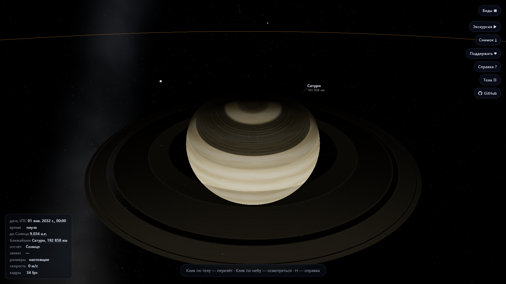
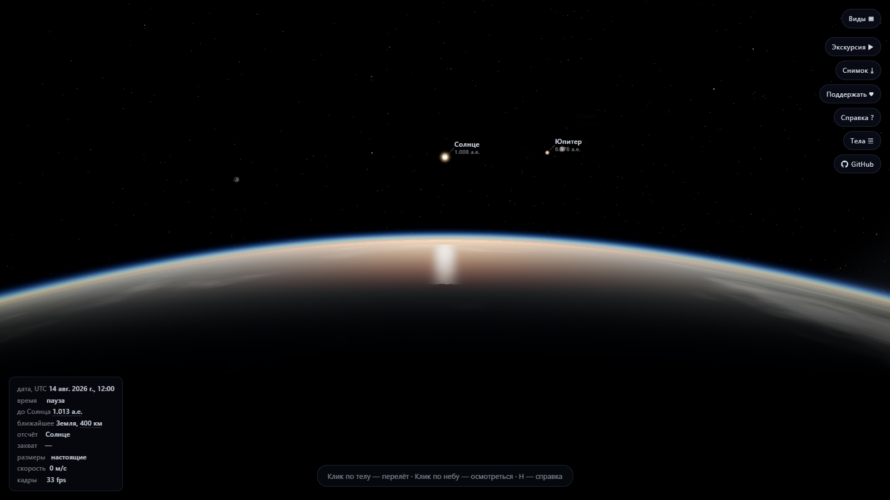
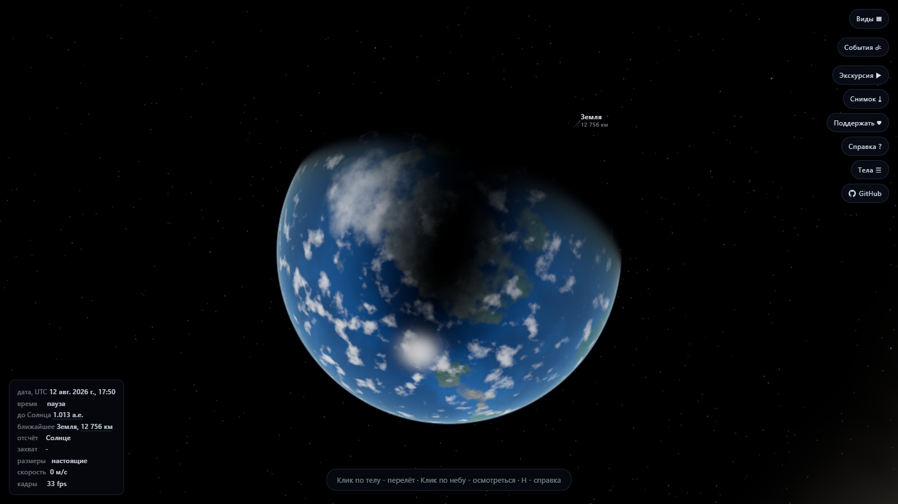
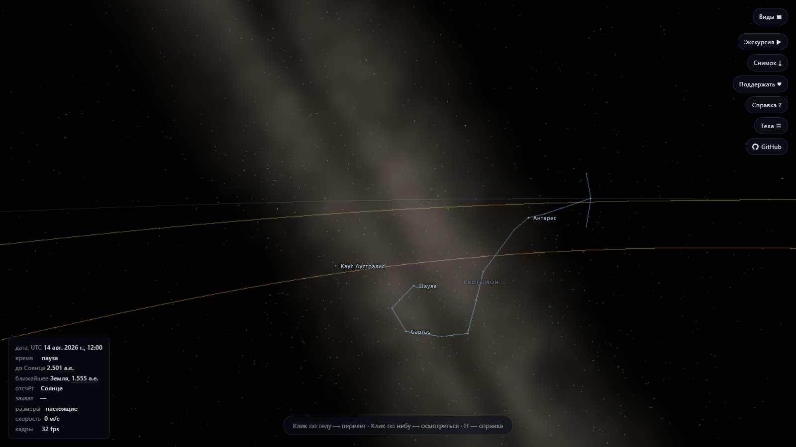
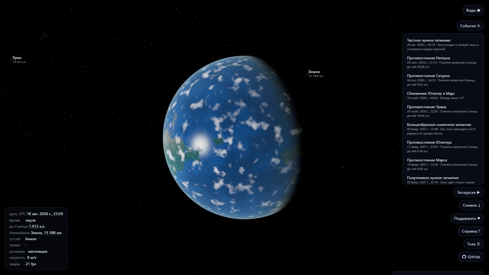

# Солнечная система

Трёхмерная модель Солнечной системы в браузере: настоящие расстояния, настоящие
размеры, орбиты по эфемеридам JPL и свободный полёт между планетами.

[](https://solar-system.ic-albatross.com/)

[](https://github.com/pavelmiskevich/solar-system/actions/workflows/ci.yml)
[](LICENSE)
[](https://threejs.org/)
[](#проверка)
[](https://pay.cloudtips.ru/p/86c3292c)


<sub>Сатурн, 1 января 2032 года. Кольца раскрыты к Солнцу почти на максимум,
на планете лежит их тень, на дальней стороне колец - тень планеты.</sub>

---

## О проекте

Симулятор рисует систему такой, какая она есть, а не такой, какой её удобно
уместить в кадр. Земля отстоит от Солнца на 149.6 млн км, Нептун - на 4.5 млрд,
и в сцене это те же числа: планеты крохотные, между ними пустота, дальние миры
тусклые. Ничего из этого не «исправлено» ради красоты - вместо этого сцене даны
средства, которыми пользуется наблюдатель: перелёт к телу одним кликом,
управление течением времени и адаптивная экспозиция, раскрывающая зрачок там,
где света в тысячи раз меньше.

Ни одной текстуры в проекте нет. Поверхности планет считаются в шейдерах:
полосы и Красное пятно Юпитера, кратеры и моря Луны, полярные шапки Марса,
океаны с облаками у Земли, серные равнины Ио. Свет - тоже настоящий: яркость
падает как 1/r², Луна ночью подсвечена отражённым светом Земли, кольца Сатурна
отбрасывают тень на планету, а планета - на кольца.

| | |
|---|---|
| **Тел в сцене** | 16: Солнце, восемь планет, Плутон, Луна и пять спутников гигантов |
| **Поиск событий** | затмения, противостояния, транзиты, сближения - по эфемеридам |
| **Звёзд на небе** | 8 920 - каталог HYG до 6.5ᵐ, предела невооружённого глаза |
| **Разметка неба** | 12 созвездий и 40 имён звёзд, вершины линий - звёзды каталога |
| **Млечный Путь** | процедурный, по галактическим координатам |
| **Атмосфера Земли** | рэлеевское рассеяние по измеренным коэффициентам |
| **Кольца** | Сатурн и Уран: полосы по данным, тень планеты, просвет с изнанки |
| **Единица мира** | километр; координаты - эклиптические, эпоха J2000 |
| **Диапазон дат** | 1800-2050 гг. с точностью элементов JPL, дальше - с ростом ошибки |
| **Зависимости** | three.js и Vite, больше ничего |

## Запуск

Нужен Node 20 или новее.

```bash
npm install
npm run dev
```

Сцена поднимется на `http://localhost:5173`. Сборка статики - `npm run build`,
результат в `dist/` и раздаётся любым сервером; никаких внешних ресурсов
страница не загружает.

Готовая сцена - на [solar-system.ic-albatross.com](https://solar-system.ic-albatross.com/);
как она туда попадает, описано в [deploy/README.md](deploy/README.md).

## Управление

При первом открытии справка показана поверх сцены; закрывается по `Esc`,
открывается снова клавишей `H` или кнопкой «Справка» в правом верхнем углу.

| Полёт | |
|---|---|
| Клик по небу | взять мышь и осмотреться |
| `W` `A` `S` `D` | вперёд, влево, назад, вправо |
| `Space` `C` | вверх и вниз |
| `Shift` | ускорение в десять раз |
| Колесо | подстроить скорость |
| `Esc` | отпустить мышь |

| Перелёт | |
|---|---|
| Наведение на тело или подпись | подсветка: видно, во что попадёт щелчок |
| Клик по телу или по подписи | перелёт к нему |
| `B` | список тел |
| `V` | готовые виды |
| `E` | ближайшие события: затмения, противостояния, сближения |
| `W` или `Esc` | прервать перелёт |
| Протаскивание мышью | повернуть тело перед камерой (после прилёта) |
| Колесо | приблизиться и отдалиться от него |
| `F` | захват цели: тело держится в центре кадра |

| Время и вид | |
|---|---|
| `P` | пауза |
| `,` `.` | медленнее и быстрее: от реального времени до двадцати лет в секунду |
| `L` | подписи тел |
| `N` | созвездия и имена ярких звёзд |
| `M` | размеры тел: настоящие, ×10, ×100, ×1000 |
| `K` | снимок кадра в PNG, без интерфейса |
| `T` | автоматическая экскурсия |
| `←` `→` | во время экскурсии - предыдущая и следующая остановка |
| Клик по расстоянию | единицы: по величине, километры, а.е., световые минуты |
| `H` | справка |

| Пальцем | |
|---|---|
| Касание по телу или по подписи | перелёт к нему |
| Протаскивание | осмотреться, а у тела - повернуть его перед камерой |
| Щипок | ближе и дальше - пока камера стоит у тела |
| Свайп | во время экскурсии - предыдущая и следующая остановка |

На телефоне нет ни клавиатуры, ни захвата мыши, то есть нет ровно того, на чём
держится всё остальное управление. Поэтому жестов три, и каждый делает то, что
на настольном экране делают мышью: касание ведёт к телу, протаскивание
осматривает, щипок приближает. Подсказка внизу экрана и таблица в справке на
сенсорном экране другие - те, что выше; подсказка про колесо там была бы
издевательством.

Жест считается от сцены, а сцена - это кадр вместе с подписями тел над ним:
подписей в кадре десяток, они ловят касания сами, и палец, поставленный на
подпись, поворачивал бы не сцену, а ничего. Кнопки, списки и карточка тела
сценой не считаются - там палец листает список.

Разметка на узком экране переставляется: панели перестают быть шире кадра,
показания уходят под верхний край, строки списков подрастают до размера,
по которому попадают пальцем.

Кнопка «Виды» открывает список готовых кадров: «Земля и Луна», «Юпитер и
галилеевы спутники», «Кольца Сатурна с ребра», «Солнечное затмение», «Луна в
тени Земли», «Тень Ио на Юпитере», «Пепельный свет», «Внутренняя система
сверху», «Уран лёжа на боку». Щелчок ставит дату и уводит камеру к
нужному телу под нужным углом. Готовый вид - это те же поля, что лежат в
адресе страницы, только записанные в коде: ссылкой на любой из них можно
поделиться.

Кнопка «События» открывает другой список - тот, которого в коде нет. Даты в нём
не записаны, а найдены: поиск проходит по эфемеридам на пять лет вперёд и
собирает затмения, противостояния, прохождения по диску Солнца, сближения
планет и пересечения плоскости колец Сатурна. Щелчок так же ставит дату и
уводит камеру - но с той стороны, с которой событие видно: на затмение смотрят
со стороны Луны, на противостояние со стороны Солнца, на кольца с Земли.

Дата и время задаются полем в справке - там же, где ползунок скорости.
Кнопка «сейчас» возвращает к текущему моменту, стрелки шагают на сутки и на
календарный год. Время всюду всемирное, и поле подписано этим прямо: местное
время развело бы введённую дату с той, что стоит в HUD.

Вид сцены пишется в адрес страницы: дата, выбранное тело, положение камеры и
скорость времени. Ссылкой можно поделиться - «смотри, вот затмение» - и
вернуться к тому же кадру после перезагрузки. Адрес читается глазами:
`?d=2032-06-01T12:00:00Z&b=saturn&r=3.4&az=41&el=12`. Испорченная часть
выбрасывается поодиночке: лучше показать верную дату без камеры, чем встретить
человека пустой сценой.

Скорость полёта подстраивается под то, что рядом: у поверхности планеты она
измеряется километрами в секунду, в межпланетной пустоте - миллионами. После
перелёта камера остаётся в системе отсчёта тела и движется вместе с ним, иначе
Уран на скорости «сутки в секунду» ушёл бы из кадра за пару мгновений.

`F` захватывает цель: камера держит тело в центре кадра, пока рулями ведут
её саму. Без захвата разгон и наблюдение исключают друг друга - стоит тронуть
рули, как тело уходит из кадра, и приходится выбирать между «лететь» и
«смотреть». Захватывается то, на что показывают: тело под прицелом в центре
кадра, если мышь захвачена, иначе - под курсором; не показали ни на что -
берётся тело, вокруг которого стоит камера. Повторное нажатие снимает захват,
выбор другой цели - тоже. Захваченное тело видно в HUD строкой «захват», и
работает захват на любом расстоянии: Юпитер можно держать в кадре и от
Нептуна.

Экскурсия (`T` или кнопка «Экскурсия») проводит по одиннадцати телам от Солнца
до Плутона: у каждого камера останавливается, медленно поворачивает его перед
собой и рассказывает, на что смотреть. Любое действие - клавиша, щелчок,
колесо - прекращает её и возвращает управление сразу же.

Смотреть её можно в своём темпе: `←` и `→` - на сенсорном экране
горизонтальный свайп - переводят на предыдущую и следующую остановку, не
досматривая текущую. С первой назад идти некуда, с последней вперёд -
экскурсия заканчивается. Вертикальное протаскивание по-прежнему обрывает её:
это человек взялся осматривать сам.

## Что видно



Тот же Сатурн и та же дата, что на снимке в начале, - но камера стоит с другой
стороны плоскости колец. С изнанки кольцо не отражает, а просвечивает, и
рисунок выворачивается негативом: широкое плотное кольцо B, самое яркое на
свету, здесь темнее разреженного C и деления Кассини, которое на освещённой
стороне выглядит тёмным провалом. Ровно так они меняются местами на снимках
«Кассини».


Юпитер: полосы, зоны и Большое красное пятно; справа Ио. Ганимеда в кадре нет -
он зашёл за планету, и подпись вместе с ним: за подписью обязано что-то стоять.
Спутники ходят в плоскости экватора планеты, повёрнуты к ней одной стороной и
держат резонанс Лапласа - периоды Ио, Европы и Ганимеда соотносятся как
1 : 2 : 4.


Земля: океаны, континенты, облачный слой и полярные шапки. Ось наклонена на
23.4°, вращение и положение полюса - по элементам МАС.



Четыреста километров над поверхностью, взгляд вдоль горизонта на терминатор.
Голубая кайма у края и красная у самого горизонта - это одно и то же
рассеяние: разница только в длине пути, который свет прошёл сквозь воздух.


Луна: кратеры разных поколений, моря, неровный терминатор. Положение считается рядом ELP2000 в изложении
Meeus - кеплеровский эллипс ошибался бы на тысячи километров, и ни фазы, ни
затмения на нём не сошлись бы.



Двенадцатое августа 2026 года, 17:50 UTC: тень Луны на Земле. Дата не подобрана
руками - в этот момент ось лунной тени проходит в 5 780 км от центра Земли при
её радиусе 6 378 и упирается в неё. Тёмное пятно посередине - полная тень,
размытая кайма вокруг - полутень, где Солнце закрыто только частью. Тень лежит
не на одной поверхности: воздух над полосой затмения темнеет вместе с землёй
под ним, потому что Солнца нет и над ним.



Млечный Путь в стороне созвездия Скорпиона, рядом с центром Галактики. Полоса
рисуется процедурно по галактическим координатам, пылевые прожилки - шумом;
линии созвездий и имена звёзд включены клавишей `N`, и вершины фигур стоят на
настоящих звёздах каталога.


Вид сверху на внутреннюю систему. Орбиты нарисованы по тем же элементам, по
которым движутся планеты, и перестраиваются раз в модельный год - вековой дрейф
медленный, но он есть.



Список ближайших событий. Даты в нём не записаны в коде: поиск проходит по
эфемеридам на пять лет вперёд и находит момент, когда ось лунной тени ближе
всего к центру Земли, планета дальше всего от Солнца по небу, а высота Земли
над плоскостью колец Сатурна меняет знак. Щелчок по строке ставит дату и
подводит камеру с той стороны, с которой событие видно.


Список тел с расстояниями до камеры и карточка тела: радиус, масса, температура,
состав атмосферы, число известных спутников, наклон оси, длительность суток и
года, расстояние от Солнца - и одна примета, ради которой на это тело смотрят.
У Сатурна и Урана к этому добавляется раскрытие колец к Солнцу: величина живая,
она меняется вместе с датой, и от неё прямо зависит, сколько света кольцам
достаётся.

Наведение подсвечивает подпись тела и меняет курсор на указатель. Планета в
этой сцене занимает доли пикселя, и то, что по ней можно щёлкнуть, из картинки
никак не следовало - об этом можно было узнать только из справки. Считает
наведение сама сцена, а не браузер: попасть курсором по телу в доли пикселя
нельзя, и то, во что попадёт щелчок, знает только выбор по экрану - тот же, что
отработает при щелчке.

Расстояния в HUD и в карточке - переключатели: щелчок меняет единицы сразу
везде, где расстояния показаны. «Восемь световых минут до Солнца» объясняет
масштаб лучше, чем «149 597 871 километр», но до Луны верно обратное - поэтому
единица не выбрана раз и навсегда, а по умолчанию подбирается под величину.

Величины в карточке делятся надвое. Радиус, масса, периоды и наклон оси
выводятся из тех же чисел, которыми считается движение, и разойтись с ним не
могут. Температура, атмосфера, число спутников и примета так не выводятся
ниоткуда: это чтение из справочника, и лежат они отдельной таблицей
(`src/data/bodyLore.ts`).

Снимки сделаны скриптом `node scripts/shots.mjs` при поднятом dev-сервере -
тем же headless-браузером, что и сквозные тесты.

## Как это устроено

**Координаты и плавающая точка отсчёта.** Мир измеряется в километрах, и до
Плутона их семь миллиардов - за пределами точности `float32`, с которой работает
видеокарта. Поэтому камера всегда стоит в начале координат сцены, а мир
сдвигается под ней: в шейдер попадают небольшие числа, и геометрия не дрожит.
Глубина пишется логарифмически - иначе на одной сцене не уживаются планета в
десяти километрах и звёзды на небесной сфере.

**Орбиты.** Планеты движутся по кеплеровским элементам из таблицы JPL
«Keplerian Elements for Approximate Positions of the Major Planets» на интервал
1800-2050 гг.; уравнение Кеплера решается итерациями Ньютона. Положение Луны
берётся из усечённого ряда ELP2000-82 (25 членов в долготе и расстоянии, 20 в
широте). Спутники гигантов заданы средними элементами JPL в плоскости Лапласа -
той, вокруг которой прецессирует их орбита; у близких спутников она практически
совпадает с экватором планеты. Вращение и ориентация осей - по отчёту рабочей
группы МАС (IAU WGCCRE).

Орбиты не только считаются, но и рисуются: гелиоцентрические - вокруг
Солнца, орбиты Луны и спутников гигантов - вокруг своих планет. Линия
появляется, когда орбита занимает в кадре заметный угол, и гаснет у самой
поверхности: вблизи тела она из разметки превращается в полосу поперёк
кадра. Линии спутников строятся теми же формулами, что и положения самих
спутников, поэтому проходят через тело по построению, а не по совпадению.

Всё это - аналитические функции времени, а не численное интегрирование.
Положение любого тела честно вычисляется на момент кадра, поэтому фиксированный
шаг симуляции не нужен, а просадка кадров не вызывает дрожания.

**Поверхности.** Один шейдер на все тела, разница - в директивах препроцессора
(каменная, газовая, земная) и в наборе параметров: цвета, контраст полос,
плотность кратеров, высота рельефа. Рельеф не геометрический, а бампом по
экранным производным, и его высота задана в настоящих километрах: у Луны это
единицы километров, и именно это делает её ночную сторону тёмной, а не
светящейся.

**Свет и экспозиция.** Освещённость падает как 1/r²: у Нептуна света в 900 раз
меньше, чем у Земли. Чтобы дальние планеты не оказались чёрными, экспозиция
подстраивается по двум величинам сразу - по расстоянию от Солнца и по яркости
самого кадра, которую сцена измеряет по уменьшенной копии буфера (98-й
перцентиль занятых пикселей). Смещение идёт в логарифмическом пространстве с
постоянной времени полторы секунды - как адаптация глаза, а не мгновенный
скачок. Отражённый свет считается отдельно: Земля освещает Луну в 8.4·10⁻⁵ от
солнечного, что соответствует −16.5ᵐ против −26.7ᵐ.

**Атмосфера.** У Земли не подсветка лимба, а настоящий слой рассеяния:
вдоль луча зрения берётся десяток точек, в каждой считается, сколько света
дошло до неё от Солнца сквозь воздух и сколько из рассеянного дойдёт до
камеры. Коэффициенты настоящие, в обратных километрах, и синий рассеивается
впятеро сильнее красного - из одного этого числа получаются и голубое небо, и
красный закат: у терминатора луч идёт сквозь толщу воздуха по касательной и
проходит в сорок раз больший путь, синего в нём не остаётся вовсе. Толщина
слоя - сто километров, высота однородной атмосферы - восемь, и оба числа
измеренные, а не подобранные.

**Кольца.** Система колец задана набором полос: внутренний радиус, внешний,
плотность и мягкость края - оттого кольца Сатурна и Урана получаются
непохожими, хотя код у них один. С освещённой стороны кольцо отражает, с
теневой - просвечивает, и это два разных явления, а не одно, помноженное на
число: сквозь слой обломков проходит exp(−τ/μ), где τ - оптическая толщина, а
μ - синус угла между лучом зрения и плоскостью колец. Оттого рисунок колец с
изнанки выворачивается негативом: плотное кольцо B, самое яркое на свету,
становится темнее разреженного C и деления Кассини - ровно так они меняются
местами на снимках «Кассини» с неосвещённой стороны.

Яркость колец падает и с наклоном их плоскости к Солнцу: у равноденствия
Сатурна они получают свет по касательной и гаснут почти до неразличимости.
Раскрытие показано в карточке строкой «кольца к Солнцу»: в 2025 году там ноль,
в начале тридцатых - двадцать семь градусов. Без этой строки тусклый кадр
читался бы как поломка.

**Поиск событий.** Даты затмений неоткуда взять - и незачем: положения тел уже
считаются точно, а событие это момент, когда некоторая величина достигает
предела. Затмение - когда ось тени проходит ближе всего к центру тела;
противостояние - когда планета дальше всего от Солнца по небу; пересечение
плоскости колец - когда высота Земли над ней меняет знак. Поиск сводит каждый
род событий к такой величине, грубо перебирает время, а найденную вилку
ужимает золотым сечением или дихотомией до часа.

Порог, отделяющий затмение от промаха, тоже не задан числом: полутень Луны на
расстоянии Земли имеет радиус около 3 500 км, и затмение есть, пока ось тени
проходит ближе, чем 6 378 + 3 500 км. Получается 1.55 земного радиуса - то
самое число, что стоит в таблицах пределом частного затмения. Оттуда же берётся
и род: кольцеобразным затмение выходит тогда, когда видимый радиус Луны меньше
солнечного, а полутеневым лунное - когда Луна в тень не вошла вовсе.

Проверка сверяет найденное с каталогом затмений NASA: все восемь солнечных и
девять лунных затмений 2025-2028 годов находятся в верном порядке, с верным
родом и с расхождением в считанные минуты. Точность у разных родов разная, и
это свойство задачи, а не небрежность: у затмения тень пробегает Землю за часы,
и момент определён остро, а у пересечения плоскости колец раскрытие меняется на
0.05° в сутки - там ошибка в направлении оси Сатурна в сотую долю градуса
уводит дату на пять часов.

**Затмения.** Тела отбрасывают тень друг на друга, и это не отдельный эффект,
а та же геометрия, что у тени колец: из точки поверхности видно два круга -
Солнце и заслоняющее тело, - и вопрос лишь в том, насколько они перекрылись.
Отсюда сразу всё: и полутень, где Солнце закрыто частью, и полная фаза, и
кольцеобразное затмение, когда Луна в апогее меньше солнечного диска. Даты
брать неоткуда - они получаются сами: двенадцатого августа 2026 года в 17:50
UTC ось лунной тени проходит в 5 780 км от центра Земли и упирается в неё,
третьего марта Луна целиком входит в земную тень, а тени галилеевых спутников
идут по облакам Юпитера чуть не каждый день. В полном лунном затмении Луна не
пропадает, а краснеет: свет доходит до неё сквозь земную атмосферу по
касательной, и синее в ней рассеивается - это закат, видимый с Луны.

Затеняется не только поверхность. Слой рассеяния над ней считает ту же долю
закрытого солнечного диска и по тем же данным: тень на воздухе и тень на земле
обязаны быть одной тенью, а разойдись они - и полоса затмения светилась бы
собственным небом. Сумерек в полной тени модель при этом не даёт: их создаёт
свет, рассеянный по нескольку раз, а считается только однократное рассеяние.

**Звёздное небо.** Каталог HYG (Hipparcos + Yale BSC + Gliese) отфильтрован по
6.5ᵐ и упакован по шесть байт на звезду - 8 920 звёзд в 72 КБ прямо в бандле,
без сетевых запросов. Экваториальные координаты переводятся в эклиптические,
цвет берётся из показателя B−V, размер точки - из звёздной величины с
сохранением потока: звезда меньше пикселя не должна терять яркость.

**Млечный Путь.** Полоса Галактики рисуется процедурно, как и поверхности
планет: карта неба в разумном разрешении весила бы мегабайты, а нужна от неё
широкая светящаяся полоса с пылевыми прожилками. Лежит она по галактическим
координатам - от направления на центр Галактики (17ʰ45ᵐ, −29°) и на её полюс,
а не подогнана на глаз. Отсюда всё остальное: в Стрельце мы смотрим сквозь
весь диск и в балдж, и там ярче всего; в Возничем - наружу, в край диска, и
полоса втрое слабее; у полюса Галактики её нет вовсе. Вдоль полосы тянется
Большой Провал - тёмная полоса пыли ближнего рукава, закрывающая всё, что за
ней.

**Разметка неба.** `N` показывает линии двенадцати созвездий и имена сорока
ярчайших звёзд - от Сириуса до Полярной. Вершины фигур - не собственные точки
разметки, а те же звёзды каталога: имена и отрезки собираются тем же скриптом
и из той же загрузки, что и само небо, поэтому линия упирается ровно в
нарисованную звезду. Отсюда и главное свойство: разметка ничего к небу не
добавляет, а показывает то, что там и так есть, - и работает не только с
Земли. Звёзды слишком далеко, чтобы перелёт на десятки а.е. что-то в них
поменял, и Орион с орбиты Нептуна остаётся Орионом.

**Производительность.** Постобработка - экспозиция и bloom - собрана в
`EffectComposer`; при просадке ниже 45 fps качество понижается ступенями
(сначала выключается bloom, затем снижается разрешение), при устойчивых 75 fps
возвращается обратно. На дискретной видеокарте сцена идёт в 130-144 fps.

## Проверка

```bash
npm run typecheck   # tsc --noEmit
npm test            # 330 юнит-тестов
npm run e2e         # 79 сквозных тестов, Playwright + Chromium
```

Юнит-тесты проверяют то, что имеет правильный ответ: положения планет
сверяются с выгрузкой JPL Horizons, резонанс галилеевых спутников - с
соотношением средних движений, форматирование величин и логика экспозиции - с
ожидаемыми числами.

Сквозные тесты проверяют то, что живёт только в браузере: скомпилировались ли
шейдеры, идут ли кадры, раскрывается ли экспозиция на ночной стороне, попадает
ли клик по Юпитеру в Юпитер, а не в Ганимед. Сцена отвечает на вопросы через
отладочный доступ `window.sim`, существующий только в режиме разработки.

На своей машине они идут минут пять, на CI - полчаса: видеокарты у runner нет,
и каждый кадр считает процессор. Поэтому там набор разделён на три доли
(`--shard`), по одной на runner, и ускорить его иначе нечем - время уходит не
на логику проверок, а на кадры.

## Язык

Интерфейс, комментарии и документация - на русском, и это выбор, а не
недоделка. Сцена объясняет себя словами: подписи тел, карточка с величинами,
справка, причины решений в комментариях. Перевод такого текста наполовину хуже,
чем его отсутствие, поэтому английский появится только вместе со слоем
локализации целиком - он есть в планах отдельным пунктом.

## Структура

```
src/
  core/       кадровый цикл, рендерер, время, единицы, плавающая точка отсчёта,
              состояние сцены для адреса страницы
  physics/    Кеплер, Луна, спутники, вращение, системы координат,
              поиск астрономических событий
  scene/      тела, кольца, атмосфера, орбиты планет и спутников,
              звёздное небо, Млечный Путь, линии созвездий, Солнце
  shaders/    GLSL: поверхности планет, кольца, точки, корона, экспозиция
  lighting/   экспозиция, отражённый свет, замер яркости кадра
  camera/     полёт, перелёт, кадрирование, система отсчёта, орбитальный режим
  ui/         подписи, списки тел, готовых видов и ближайших событий,
              карточка, справка, HUD, поле даты, ползунок скорости,
              снимок кадра, попадание кликом
  data/       определения тел, внешний вид, каталог звёзд, разметка неба,
              готовые виды, описание найденных событий
tests/        юнит-тесты (vitest)
e2e/          сквозные тесты (playwright)
scripts/      сборка каталога звёзд и разметки неба, снимки для описания
```

## Планы

Что имеет смысл сделать дальше - на [доске](https://github.com/users/pavelmiskevich/projects/1)
и в [задачах](https://github.com/pavelmiskevich/solar-system/issues): тач-управление
и мобильные устройства, английская локализация, пояс астероидов, остальные
крупные спутники, комета Галлея.

Задачи размечены тремя осями - раздел, трудоёмкость и критичность, - и порядок
читается по последней: без тач-управления сцена на телефоне не работает вовсе,
а пояс астероидов той же трудоёмкости ничего не чинит. Как это устроено - в
[ROADMAP.md](ROADMAP.md).

## Источники данных

- JPL, *Keplerian Elements for Approximate Positions of the Major Planets*
- JPL, *Planetary Satellite Mean Elements*
- IAU WGCCRE, *Report on Cartographic Coordinates and Rotational Elements*
- Jean Meeus, *Astronomical Algorithms* - ряд ELP2000 для Луны
- [HYG Database](https://github.com/astronexus/HYG-Database) - каталог звёзд

---

## Поддержать автора

Понравился симулятор? Буду благодарен за любую поддержку - она идёт на развитие
проекта.

<a href="https://pay.cloudtips.ru/p/86c3292c">
  
</a>

Оплата в один клик через **СБП**, **T-Pay**, **SberPay** или банковские карты.
То же самое есть в самой сцене - кнопка «Поддержать» в правом верхнем углу,
там же QR-код.

---

## Лицензия

Код распространяется по лицензии [MIT](LICENSE).

Текстур в проекте нет, поэтому и чужих изображений в нём нет: все поверхности
считаются в шейдерах. Из внешних данных используются только числа -
эфемеридные таблицы JPL, элементы вращения МАС и каталог HYG, который сам
распространяется свободно.
